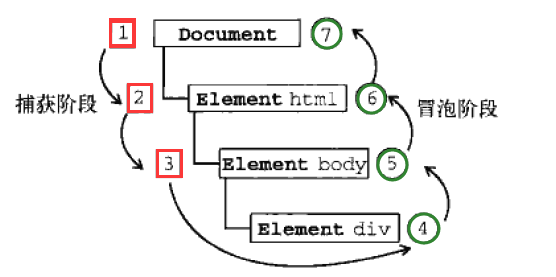

### 1. 事件流
#### 定义：
- DOM文档是一个树形结构，当一个HTML元素产生一个事件时，该事件会在元素节点与根节点之间的路径传播，路径所经过的节点都会收到该事件，这个传播过程可称为DOM事件流。其独特之处在于：文本节点也会触发事件（IE中不会）。
#### 描述的是：
- 从页面中接收事件的顺序
#### 两种事件流模型：
- 冒泡型：最特定的事件目标到最不特定的事件目标，即从DOM树的子到根
- 捕获型：最不特定的事件目标到最特定的事件目标，即从DOM树的根到子
#### 浏览器支持：
- 所有现代浏览器都支持事件冒泡，但在具体实现中略有差别  
IE5.5及更早版本中事件冒泡会跳过<html>元素(从body直接跳到document)  
IE9、Firefox、Chrome、和Safari则将事件一直冒泡到window对象。

- IE9、Firefox、Chrome、Opera、和Safari都支持事件捕获。DOM标准要求事件应该从document对象开始传播，但这些浏览器都是从window对象开始捕获事件的。
- 由于老版本浏览器不支持，很少有人使用事件捕获。建议使用事件冒泡。
#### DOM事件流：
- DOM事件流采用捕获和冒泡，两种事件都会触发DOM的所有对象从document对象开始，也在document对象结束

- DOM标准规定的三个阶段 
  
事件捕获阶段：实际目标在捕获阶段不会接收事件(1-3)  
处于目标阶段：事件在实际目标上发生并处理（事件处理会被当成冒泡阶段的一部分）  
冒泡阶段：事件传播回文档  
**PS: 并非所有的事件都会经过冒泡阶段，有的会跳过冒泡阶段。**

### 2.事件
#### 定义：
- 文档或者浏览器窗口中发生的，特定的交互瞬间，可以是用户或浏览器执行的某种操作，如click,load等
#### 事件对象event:
- 解释：在触发dom上的事件时都会产生一个对象

- DOM中的事件对象：  
type:事件类型  
target：事件目标  
stopPropagation():阻止事件冒泡  
preventDefault()：阻止默认行为

- IE中的事件对象  
type:事件类型   
srcElement:事件目标  
cancelBubble()：阻止事件冒泡true，false 不阻止  
returnValue(): 阻止事件的默认行为 false为阻止  

### 3. 事件处理程序

- HTML事件：在html结构中直接添加，两种代码耦合到一起，不易维护（修改时种都要改）

- dom0级事件：较传统的方式，把一个函数赋值给一个事件的处理程序（使用较多简单，跨浏览器），先取元素，然后把函数当做元素的一个属性进行添加，删除时可接赋值为null

- DOM2级事件：定义了两个方法，用于处理指定和删除事件处理程序的操作
```
addEventListener()和removeEventListner()
接收三个参数：要处理的事件名、作为事件处理程序的函数名、布尔值
事件名前面不用有on
true为加到捕获阶段，false为加到冒泡阶段
使用此方法添加事件，就只能用该方法删除
后两种方法可以给一个元素添加多个事件
```
- IE事件处理程序  
attachEvent()添加事件，detachEvent()删除事件
只有两个参数，没有布尔值

- 跨浏览器的事件处理程序  
进行能力检测，不同浏览器用不同事件监听
```
var eventUtil={
	addHandler:function(element,type,handler){
		if(element.addEventListener){
			element.addEventListener(type,handler,false);
		}else if(element.attachEvent){
			element.attachEvent("on"+type,handler);
		}else{
			element["on"+type]=handler;
		}
	}
	removeHandler:function(element,type,handler){
		if(element.removeEventListener){
			element.removeEventListener(type,handler,false);
		}else if(element.deachEvent){
			element.detachEvent("on"+type,handler);
		}else{
			element["on"+type]=null;
		}
	}
}
eventUtil.addHandler(btn3,"click",showMes)
//注意：element["on"+type]=element.type(但后面这种不能用字符串的加法)
```

### 4. 事件代理
#### 原理：
- 使用事件冒泡，将事件处理器添加到父元素，等待子元素冒泡，父元素能通过target属性判断是哪个子元素从而进行事件处理

#### 优点：
- 代码简洁
- 将多个事件处理器减少到一个，减少浏览器内存占用，提高了性能  

- DOM更新无需重新绑定事件处理器，因为事件代理对不同子元素可采用不同处理方法。如果新增其他子元素（a,span,div等），直接修改事件代理的事件处理函数即可，不需要重新绑定处理器，不需要再次循环遍历。
#### 问题：
- 当事件绑定同时绑定了子元素和父元素时，会有两次冒泡
```
<ul>
    <li><a></a></li>
</ul>

<script>
$(document).on('click', 'li', function(e){
        alert('li li');
    });

$(document).on('click', 'a', function(e){
        alert('li a');
    })
</script>
```
- 解决方法
1. 在a的事件处理程序中阻止冒泡
```
$(document).on('click', 'a', function(e){
        alert('li a');
        e.stopPropagation();
    })
```
2. 在li的target属性中检测a
```
$(document).on('click', 'li', function (e) {
        if (e.target.nodeName == 'a') {
            e.stopPropagation();
            return;
        }
        alert('li li');
    });
```

### 5. 事件类型
#### 表单事件:
- input,select,change,reset,submit

#### 文档事件：
- 网页的加载与卸载相关：load，beforeunload，unload

- 与文档状态相关: DOMContentLoaded，readystatechange

- 与窗口行为有关： scroll，resize

- 与文档的URL变化相关：hashchange，popstate

- 文本操作触发的事件：cut，copy，paste

- 焦点事件：focus，blur，focusin，focusout

#### 鼠标事件MouseEvent对象：
- mouse，down mouseup click dblclick，mousemove mouseover mouseout，mouseenter mouseleave，contextmenu，wheel

#### 键盘事件KeyboardEvent对象：
- keydown，keypress，keyup

#### 进度事件ProgressEvent对象：
- abort， error，load， loadstart，loadend，progress，timeout

#### 拖拉事件DragEvent对象：
- drag，dragstart，dragenter，dragover，dragleave，drop

#### 触摸事件：
- touchstart，touchend，touchmove，touchenter，touchleave，touchcancel

#### 自定义事件和事件模拟